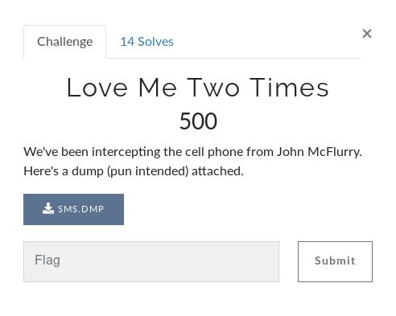
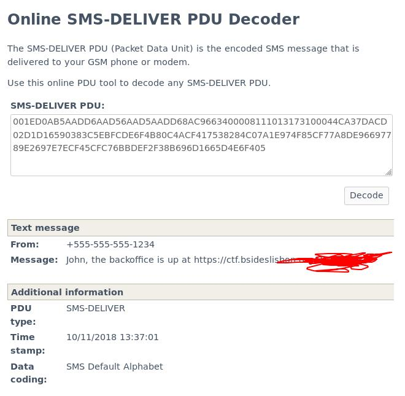

  # Love Me Two Times

 In this challenge we know by the category it's a Web exercise.
It says:

> We've been intercepting the cell phone from John McFlurry. Here's a dump (pun intended) attached.

## Inital Analysis

The file SMS.DMP is given.

## Development

After analysing the file, we come to the conclusion that they are just several encoded SMS in which , after using a online tool such as:

> https://www.diafaan.com/sms-tutorials/gsm-modem-tutorial/online-sms-deliver-pdu-decoder/

After we decode all the messages we can gather some information, namely the website.
User credentials

>john:master

And two 2-Factor-Authentication tokens with the given timestamps.

>392756 @ 10/11/2018 14:16:09

>664211 @ 11/11/2018 09:52:12

__NICE__

We can then login to the website using the combination john:master, but there is a prompt for a 2-Facto-Authentication.

Since we have 2 previously used codes, and we know that TOTP's are generated by a static keyword and the timestamp, we can reverse the function to try and get the static keyword, soo we can print a new 2FA token for our timestamp.

> Timestamp ^ Keyword = Token

After bruteforcing the given tokens with a wordlist, we come to the conclusion that the keyword is:

> imdead

Then we quickly encrypt a new token for our current timestamp (which is the same as the server's), and we are granted the last flag of this challenge.