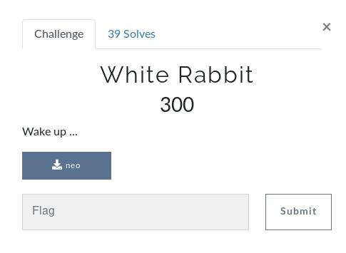
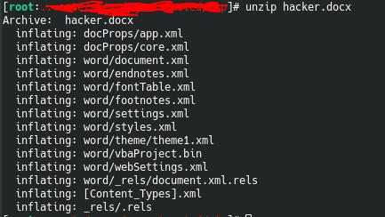

# White Rabbit

 In this challenge we know by the category it's a forensics exercise it says:

> Wake up ...

## Inital Analysis

The file neo is given.

## Development

After analysing the file, we come to the conclusion that its an image, in which there is more data embeded, after extracting with the command:

> binwalk -e neo

A new image is obtained called 115b3.

__This is a loop hole.__ 

After further investigation, we find that there is a file signature for a word document inside the first image, in which the bits are out of place (4B 50 03 04) and we want (50 4B 03 04).

After changing this, we can get a new file, which is hacker.docx.

Since word documents work like zip files, we can just unzip it.

We can quickly notice it has macros embedded into it, soo we can use oletools, namely the olevba tool to extract whats inside the macro.

The oletools can be found in the following repository:

>https://github.com/decalage2/oletools/

Then we run the command

> olevba hacker.docx

After that, we get a hexadecimal string, which after decoded is the right flag!